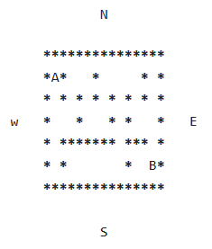
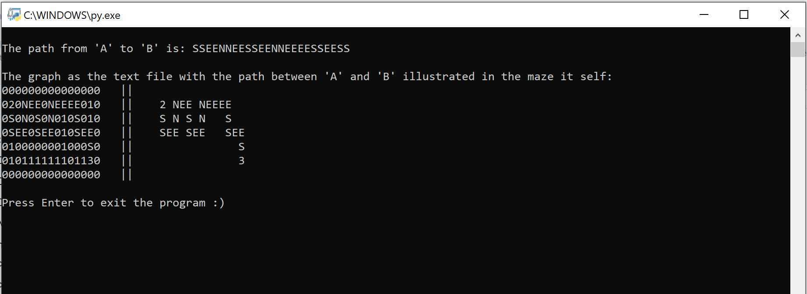
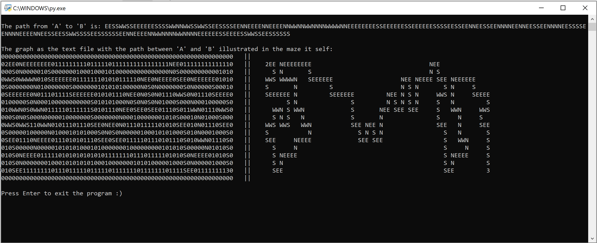

**Python (BTI7541a) 20**

This project addresses the problem of finding a path in a maze from a point 'A' to a point 'B'.For this project a maze is contained in a text file as illustrated below. The '*' represent the walls of the maze. The four diection 'N' (north), 'S' (south), 'W' (west), and 'E' (east) are the four directions to represent a path from the initial point 'A' to the final point 'B'.

Initial point 'A' is always located in the top-left corner and the final point 'B' in the bottom-right corner.

For this example, the path from 'A' to 'B' is "SSEENNEESSEENNEEEESSEESS".
A first type of maze is provided in the file maze-one.txt. 
For this maze we have the garantie that one and only one path exists between 'A' and 'B'. 

**Project result:**

print on the console the string that represents the path between 'A' and 'B' as explained above.
display on the console the graph as the text file with the path between 'A' and 'B' illustrated in the maze it self

**Left:** graph with path in the maze
**Right:** graph with path without maze

*If you could not see the graph as following pictures, customize the width of your cmd-screen*

